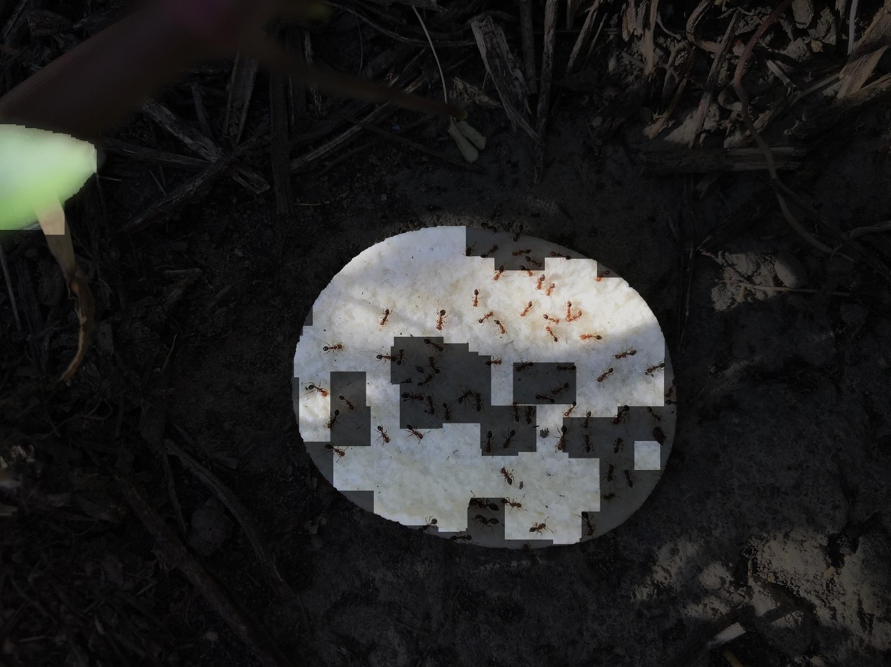
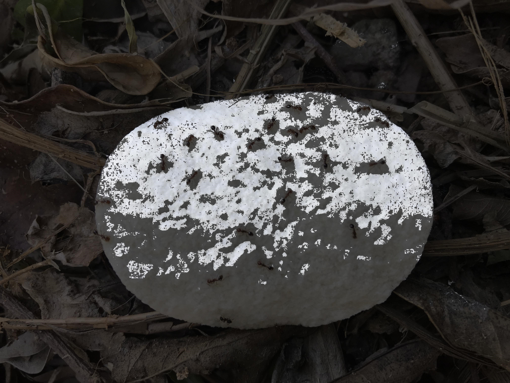

# Image segmentation for red fire ant

## Original Method

This method try to extract potato chips from image by traditional image processing method.

### Steps

1. Convert to gray
2. Normalization
3. Image binarization by Otsu's threshold
4. Erode 30 times to filter the noise.
5. Dilate 30 time to compensate area eroded
6. Extract the contours, keep the largest area
7. Fill in the area by convex hull
8. Extract the area inside the polygon.
9. Crop the polygon out.

### Usage

#### GUI

    python src/main.py

#### Process all images in Image directory

    python src/segmentation.py

### Result

### Conclusion

-   Advantage

    - Simple
    - Fast

-   Shortage

    - Unable to handle the cracked chips
    - Performance is bad once the photo was not taken properly.

## Level Set Method

Try to extract potato chips by level set method.([Ref](https://wiseodd.github.io/techblog/2016/11/20/levelset-segmentation/))

### Steps

    python src/level_set.py IMAGE_PATH

### Result

### Conclusion

- Shortage
    - Very very slow....

## Convex Shape Prior for Multi-Object Segmentation Using a Single Level

Try to reproduce the result([Ref](http://openaccess.thecvf.com/content_ICCV_2019/papers/Luo_Convex_Shape_Prior_for_Multi-Object_Segmentation_Using_a_Single_Level_ICCV_2019_paper.pdf)), but failed. I sent an email to the first author asking for help, but receiving no reply.

## Experiment

另外有試過嘗試先轉成HSV後，再根據H值濾出，避免因為取灰階而造成把灰階一樣但顏色明顯不同的部分採納進去(如下圖)

